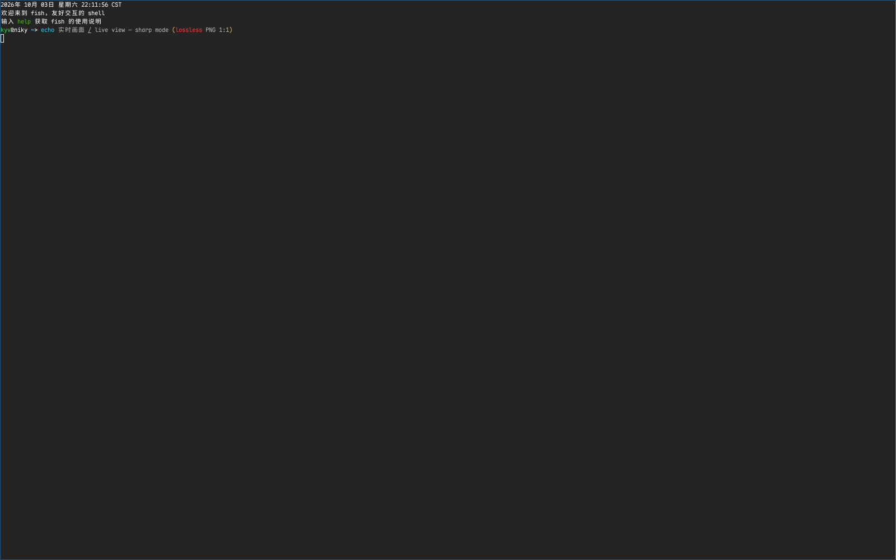

# dsh-wayland

A DSH bundle that runs **headless Wayland desktops** and puts them in the right
sidebar, with agent tools to drive them.



- **Right sidebar panel** — a `wayland` tab type that streams the session
  (`grim` → MJPEG) and forwards your mouse and keyboard into it.
- **Eight agent tools** — create/list/close sessions, launch programs, list
  windows, screenshot (whole output or one window, returned as an image), inject
  keyboard/pointer/focus events, and check the plugin's own health.
- Each session is an isolated sway compositor with its own `XDG_RUNTIME_DIR`,
  Wayland socket, Xwayland display and window set. Nothing appears on your real
  desktop.

## Runtime dependencies

The plugin is dependency-free JavaScript (node builtins only), and the published
package ships **no** binaries: everything it runs comes from the host machine,
resolved through `config.binDir` first and then `PATH`.

| Binary | Required | Used for |
|---|---|---|
| `sway` | yes | the headless compositor that hosts every session |
| `swaymsg` | yes | sway IPC: window tree, focus, output background |
| `grim` | yes | screenshots and the live panel frames |
| `wtype` | yes | keyboard injection |
| `wlrctl` | no | pointer fallback, only on a compositor that lacks `zwlr_virtual_pointer_manager_v1` |
| `wl-copy` | no | pasting non-ASCII text |
| `foot` | no | the terminal the panel's *New* button starts by default |
| `wayvnc`, `wf-recorder` | no | reserved for the planned smooth stream and recording |
| `xterm` | no | legacy X11 terminal (renders poorly in these sessions) |

**A missing dependency is never fatal.** Activation always succeeds; when
something required is absent:

- the startup log prints the whole report once;
- `wayland_check` always succeeds and carries the toolchain: what resolved and
  through which source, what is missing, what each binary is for, and the install
  lines your distribution needs (Debian/Ubuntu, Fedora, Arch, plus a generic
  "put them on PATH" line for everything else), plus whether those binaries
  actually run, whether the session root is writable, and one health line per
  live session;
- the tools that need the toolchain (`create`, `launch`, `windows`, `screenshot`,
  `input`) fail *with that report as the message* rather than a bare `ENOENT`;
- the sidebar panel shows the same missing names and the two ways to fix it.

Resolution is re-read on every retry while something is missing, so installing a
binary and calling the tool again works **without reloading the plugin**.

### Making the toolchain visible

The plugin asks the operating system for a binary named `sway` (and `swaymsg`,
`grim`, `wtype`, and `wlrctl` when it needs the pointer fallback), exactly like a
shell would: it walks `PATH` in order and uses the first hit, or the directory
named by `config.binDir` when that is set. So "installing the toolchain" means
nothing more than putting those binaries where the *DSH process* can find them —
on most distributions that is already true after a normal package install.

Pointer input itself needs **no** binary: each session opens its own persistent
`zwlr_virtual_pointer_v1` (see *Input injection* below).

The one trap is that a DSH launched from a desktop icon or a service **inherits
the session environment, not your interactive shell's**, so a `PATH` export in
`~/.bashrc` does not reach it. Check what the running process actually sees:

```sh
# the session environment
systemctl --user show-environment | grep '^PATH='
# the running DSH process itself
tr '\0' '\n' < /proc/$(pgrep -f 'DeepSeek Harness' | head -1)/environ | grep '^PATH='
```

If the binaries are missing there, either install them at a location that is
already on that `PATH` (system packages normally are), add the directory to the
session environment the way your distribution does it, or hand the plugin the
directory directly:

```yaml
# your profile patch (applied after bundle layers), not the package's own patch
- id: dsh-wayland
  config:
    binDir: /abs/path/to/toolchain/bin
```

`binDir` is also the way to **pin an exact build**: keep whatever toolchain you
like — distribution packages, a self-built prefix, a checkout of your own — in
one directory and point `binDir` at its `bin/`. The plugin never downloads,
builds or upgrades anything itself.

Install lines, matching what the tools report:

```sh
sudo apt install sway grim wtype wlrctl foot wl-clipboard   # Debian/Ubuntu
sudo dnf install sway grim wtype wlrctl foot wl-clipboard   # Fedora
sudo pacman -S sway grim wtype wlrctl foot wl-clipboard     # Arch
```

## Install

From a registry, with the CLI or the Plugin Manager's `install_bundle`:

```sh
dsh plugin --profile <profile> add dsh-wayland
```

The package declares `dsh.bundle.patch`, so installation selects it as a profile
layer; enable it in the sidebar's **Plugins** page if it is not enabled yet. It
ships no machine-specific configuration — `binDir` starts empty, which means
PATH. For local development, install the directory and add a development row:

```yaml
# your profile patch
- insert:
    - id: dsh-wayland-dev
      name: 'file:///abs/path/to/dsh-wayland/plugin/host.js?v=1'
      config:
        binDir: /abs/path/to/toolchain/bin
```

> **Module generation.** The Host process caches plugin modules for its whole
> lifetime, so a *changed* bundle needs a DSH restart before the new code runs.
> The plugin also dedupes itself in-process: if the same code is mounted twice
> (for example an installed bundle beside a development row), the second mount
> stands down instead of registering duplicate tools and routes.

## Using the panel

| Control | What it does |
|---|---|
| **Session** | Which session the panel shows. One at a time; the list refreshes every 4 s. |
| **New** | Starts a headless desktop sized to the panel's physical pixels (DPI aware, capped at 1920 wide) and opens the default terminal in it, so the picture is never upscaled. |
| **Refresh** | Re-reads the session list and the access token. Use it when the picture is stuck or the panel reports 403. |
| **Close** | Shuts the shown session down: every program in it is terminated and its temporary files are removed. |
| **Control on/off** | On: the panel captures the mouse and keyboard and forwards them into the session. Off: watch only. |

Every control carries a hover tooltip that says this in place, and the panel
follows the sidebar's own 14px type scale instead of a smaller hardcoded size.
The two on-screen overlays are localised too: the left one is the live metrics
(HUD), the right one repeats the input state.

Copy is translated through the client locale service (`zh` and `en` dictionaries
registered under the `dsh-wayland` namespace), so it follows Settings → General →
Language. Without that service the panel falls back to English and still works.
Shell commands and package names inside dependency reports stay verbatim in the
language the Host generated them.

## Live view

The panel pulls one frame per request (not an opaque MJPEG pipe) so it can show
what is actually happening: JPEG at 1:1, 20 fps, quality 82 by default. Measured
on a Ryzen 7 5800H with `btop` animating at 1600x1000: 19.9 fps sustained over
5 s, worst frame 46 ms against a 50 ms budget, ~229 KB per frame. Unbounded
throughput is ~31 fps.

There is deliberately **no frame-format toggle in the panel**: `liveFps`,
`liveQuality` and `liveMediaType` are Host config keys, so the rate and format
are chosen once for the deployment. PNG (`liveMediaType: image/png`) is the
pixel-exact option for text: cheap on flat content (~7-30 KB per 1600x1000 frame)
and expensive on graphics (~270-310 KB).

The HUD reads `● 19.9 fps · 32 ms · 229 KB · 1600x1000`, switches to
`◌ stalled · last frame Ns ago` when no frame arrives for 3 s, and to
`‖ paused · panel not visible` when the window is hidden.

## Configuration

| Key | Default | Meaning |
|---|---|---|
| `binDir` | `''` (PATH) | directory searched for the toolchain *before* PATH; empty searches PATH only |
| `sessionRoot` | `$XDG_RUNTIME_DIR/dsh-wayland` | per-session runtime directories |
| `width` / `height` | `1280` / `800` | headless output size |
| `liveFps` | `20` | panel frames per second |
| `liveQuality` | `82` | panel JPEG quality (used when `liveMediaType` is jpeg) |
| `liveMediaType` | `image/jpeg` | panel frame format: `image/jpeg` or `image/png` |
| `streamFps` / `streamScale` / `streamQuality` | `10` / `0.6` / `70` | the standalone MJPEG `/stream` endpoint |
| `screenshotMediaType` | `image/png` | what `wayland_screenshot` captures: `image/png` or `image/jpeg`. A deployment setting — the tool exposes no format parameter |
| `screenshotQuality` | `85` | JPEG quality for that capture, when the format above is jpeg |
| `inputLeadMs` | `60` | how long the virtual keyboard waits for the client's focus handshake before its first key |
| `inputKeyDelayMs` | `20` | gap between keystrokes when typing text |
| `cursorTheme` | `''` (detect) | xcursor theme the pointer sprite is drawn from. Empty takes the first installed theme that ships `cursors/left_ptr`; sway falls back to its own smaller built-in cursor when nothing is found |
| `cursorSize` | `24` | pointer sprite size in pixels, clamped to 8–512 |
| `maxSessions` | `6` | concurrent sessions |
| `defaultApp` | `foot` | program the sidebar's *New* button starts |

## Tools

| Tool | Purpose |
|---|---|
| `wayland_session_create` | start a session (optional name/size), returns its id |
| `wayland_session_list` | live sessions: id, name, size, programs started, whether the compositor is still alive |
| `wayland_check` | plugin health: the toolchain report (what resolved, what is missing, how to fix), whether those binaries actually run, whether the session root is writable, whether a cursor theme was found, and one health line per live session — always succeeds |
| `wayland_session_close` | stop the session and every program in it |
| `wayland_launch` | start a program inside the session; returns pid, an `outcome` (`window` / `exited` / `timeout` / `skipped`), the exit code when it ended, and the session log |
| `wayland_windows` | mapped windows: id, app id, title, pid, absolute rect |
| `wayland_screenshot` | capture output or window, returns the image |
| `wayland_input` | ordered directives: primitives `move` / `press` / `release` / `scroll` / `wait` / `raise`, sugars `click` / `drag` / `type` / `key` |

## Input injection

**Pointer.** Coordinates are session pixels from the top-left, and they are exact:
each session opens **one** `zwlr_virtual_pointer_v1` and keeps it for the session's
lifetime, then positions the cursor with `motion_absolute` (x/y in session pixels,
extent = session size), so there is no "where did the cursor start" state to get
wrong and no accumulated drift. `click` sends a press and then a release of the
matching Linux button code (`left`/`middle`/`right` = 272/274/273), `scroll` sends
wheel axis events. Every command is followed by a `wl_display.sync` round trip, so
by the time `wayland_input` returns the compositor has processed it and an
immediately following screenshot shows the result.

The obvious alternative — shelling out to `wlrctl` per action — does **not** work
on sway, and that is why the plugin speaks the protocol itself. `wlrctl` creates a
virtual pointer, sends the event and exits; when that device is destroyed the seat
loses its pointer focus, and wlroots drops a button event whose
`pointer_state.focused_client` is null. The visible symptom is that motion works
and **clicks never arrive**, while the tool still reports success. (`bindsym
--whole-window button1` in the session fires for such a click, which shows the
button reached the compositor, not the client.) `wlrctl`'s motion is also relative
only, and a headless sway cursor does not start at `(0,0)`. Both were measured; see
the repository README §3.3 and §9.

On a compositor without `zwlr_virtual_pointer_manager_v1` the plugin degrades to
`swaymsg seat <seat> cursor set <x> <y>` and then to relative `wlrctl` moves; there
`click` may still be dropped, so treat that path as move/keyboard only.

**Keyboard.** `wtype` with a lead delay (`inputLeadMs`, 60 ms by default) covering the
client's focus handshake — the first keystroke is otherwise lost. **Non-ASCII text**
goes through the clipboard (`wl-copy` + Ctrl+V) because the virtual-keyboard protocol
cannot carry arbitrary characters; the target program must accept paste. A key cannot
be *held*: `wtype` builds and destroys a virtual keyboard per call, so key state does
not survive between calls (the same shape of problem as `wlrctl` losing clicks). A key
is therefore always pressed and released inside its own `key` directive, while mouse
buttons — owned by the session's persistent pointer — can be held across calls, which
is what makes long-press and `drag` expressible.

**Directives are validated first.** `wayland_input` checks the whole list — shape,
ranges, chords, and that named windows exist — before sending the first event, so a
rejected call leaves the session untouched and reports the action index and field.

## HTTP surface (what the sidebar uses)

Registered under `/dsh-wayland` on the DSH web server.

- `GET /dsh-wayland/boot` — unauthenticated, same-origin-readable:
  `{ token, base, sessions, toolchain }`. A cross-origin page can send this but
  cannot read the reply.
- `GET /dsh-wayland/stream?session=&fps=&scale=&quality=` — MJPEG
  (`multipart/x-mixed-replace`) for the panel.
- `GET /dsh-wayland/frame?session=&mediaType=&scale=&quality=` — one frame
  (JPEG by default, PNG on request); the response carries `X-Frame-At`. Use this
  for pixel-exact work, since a screenshot tool result is re-encoded for the model.
- `POST /dsh-wayland/api` `{method, params}` — `sessions.list`, `sessions.create`,
  `sessions.close`, `apps.launch`, `windows.list`, `input`, `screenshot`.
  `input` takes `{ session, window?, actions: [{ do, ... }] }` — the same directive
  shape the `wayland_input` tool exposes (the sidebar sends the mouse and keyboard
  it captures through it).
  Every call needs the `x-dsh-wayland-token` header (or `?token=`).
- The token is also written to `<sessionRoot>/token` (mode 0600) and injected
  into the page as `window.__DSH_WAYLAND__` for the panel.

## Known limitations

- **Software rendering only** on hosts without `/dev/dri`: sway runs on the
  pixman renderer. The live view captures one `grim` frame at a time (~32 ms for
  1600x1000 JPEG, ~70 ms for PNG), so the 20 fps default keeps about two thirds
  of one core busy while the panel is visible. For genuinely smooth video
  (30-60 fps, damage-driven, H.264) the upgrade path is `wayvnc` plus a VNC
  client in the page.
- **Frame format is a trade-off, not a rule.** PNG is smaller than JPEG on flat
  text content (7-30 KB vs 44 KB per 1600x1000 frame) and much larger on
  graphics-heavy content (~300 KB vs ~230 KB), which is why JPEG at 1:1 is the
  default and PNG is a deployment-level choice (`liveMediaType`) rather than a button.
- **Session state is ephemeral**: runtime directories and sockets live under
  `sessionRoot` (default `$XDG_RUNTIME_DIR`, a tmpfs). They disappear on logout
  or reboot; sessions do not survive a DSH restart either, because the plugin
  kills them on unload.
- **Non-ASCII text** is injected through the clipboard (`wl-copy` + Ctrl+V)
  because the virtual-keyboard protocol cannot type arbitrary characters or CJK.
  The target program must accept paste.
- **`xterm` renders garbled** inside these sessions (Xwayland font/rendering
  path); `foot`, `konsole` and other Wayland-native terminals are fine.
- Graphics-heavy programs (browsers with GPU compositing) are slow or refuse to
  start without a DRM device.
- Self-typing loses the first keystroke unless the virtual keyboard waits;
  `wtype -s` is used to cover the client's focus handshake.
- **Clicks need `zwlr_virtual_pointer_manager_v1`.** sway/wlroots always provide
  it, so this only matters on another wlroots compositor; there the plugin falls
  back to `swaymsg seat … cursor set` plus `wlrctl`, where clicks can be dropped.
  `wayland_check` reports the toolchain *and*, per session, whether this protocol
  is offered; the fallback is announced on stderr (`no persistent virtual
  pointer …`) when it happens.
- **A key cannot be held** (see *Input injection*): `key` is always a press and a
  release inside one directive, because `wtype` rebuilds its virtual keyboard per
  call. Mouse buttons can be held, so long press and `drag` work.
- **Screenshot encoding is a deployment setting, not a model choice.**
  `wayland_screenshot` accepts no format or quality parameter: it captures
  `screenshotMediaType` (default PNG — lossless, and usually smaller for flat UI:
  a plain 800x600 frame measured 2.8 KB as PNG against 13.7 KB as JPEG) at
  `screenshotQuality` when that is jpeg. The two knobs live in config so a model
  cannot spend a call on them; the HTTP `/frame` route keeps its own `mediaType`
  and `quality` query parameters for other consumers. The harness hands the model
  its own copy (its note says "may be resized or re-encoded"), so for grim's exact
  bytes use `GET /dsh-wayland/frame?mediaType=png`.

## Not implemented yet

Planned next, in this order: session recording (`wf-recorder` video, pipewire
audio), structured window content extraction (AT-SPI over the session bus),
DBus call/monitor tools, and the smooth `wayvnc` stream.
